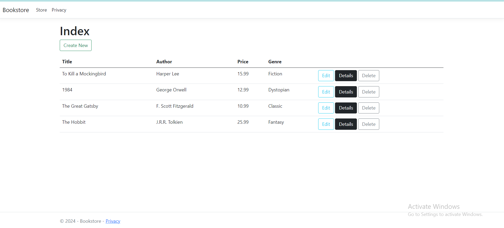

# Bookstore Management Platform

## Overview

This project is a Bookstore Management platform developed using the MVC architecture in ASP.NET Core. The application allows you to manage books by implementing CRUD operations (Create, Read, Update, Delete).

### By the End of This Project:
- You will have built a complete MVC-based ASP.NET Core application.
- Implemented CRUD operations for managing books.
- Used Entity Framework Core for data management and SQL Server for database storage.
- Created forms with validation for book creation and editing.

## Application Setup

### Prerequisites
- .NET 6 SDK or higher
- SQL Server
- Visual Studio or VS Code
- Git
 
### Installation

1. **Clone the Repository**:
   ```sh
   git clone git@github.com:muathmm/Bookstore.git
   cd Bookstore

  